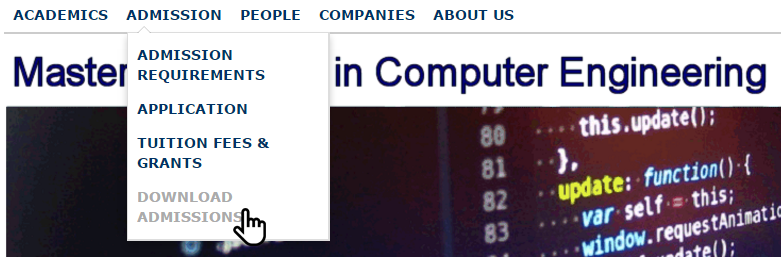
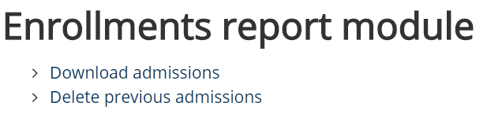
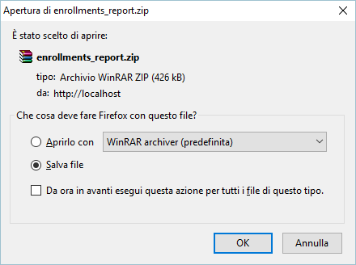

# `enrollments-report`
Joomla reporting module for foreign students selection applying to M.Sc. programmes in [Computer Engineering at the University of Pisa](https://computer.ing.unipi.it), Italy.

## What is it
At the beginning of each Academic Year, the [Computer Engineering department at the University of Pisa](https://computer.ing.unipi.it), Italy, needs to make a selection of foreign candidates applying to M.Sc. programmes.\
At the time of writing of this thesis, there was no way for the personnel responsible for carrying out the selection to retrieve information submitted by candidates through the registration form, if not manually from the database and the web server's file system official website of the courses.

This is a Joomla PHP module that allows the dedicated personnel to download an archive containing:
1. All the candidates' attachments, and
1. An Excel file, automatically filled with candidates' data.

  

  

  

The selection of candidates is made possible by the Excel file itself, thanks to a dedicated column with "admitted/rejected" checkboxes.

The module has been used by staff from the following academic year onwards.

#### Further details
- [Bachelor's thesis](https://marcomicera.github.io/projects/bsc_thesis/BSc%20Micera's%20thesis.pdf) (in Italian)
- [5-minutes slideshow](https://marcomicera.github.io/projects/bsc_thesis/BSc%20Micera's%20slideshow.pdf)  (in Italian)
